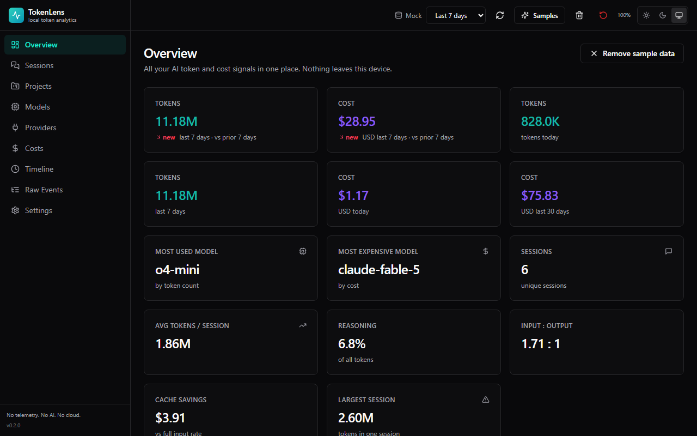
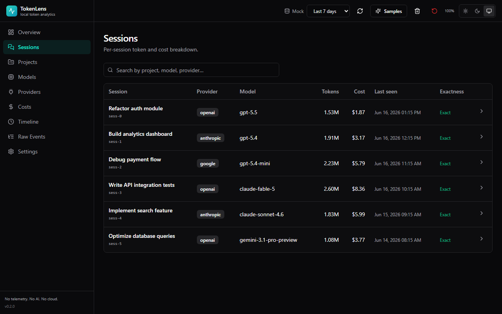
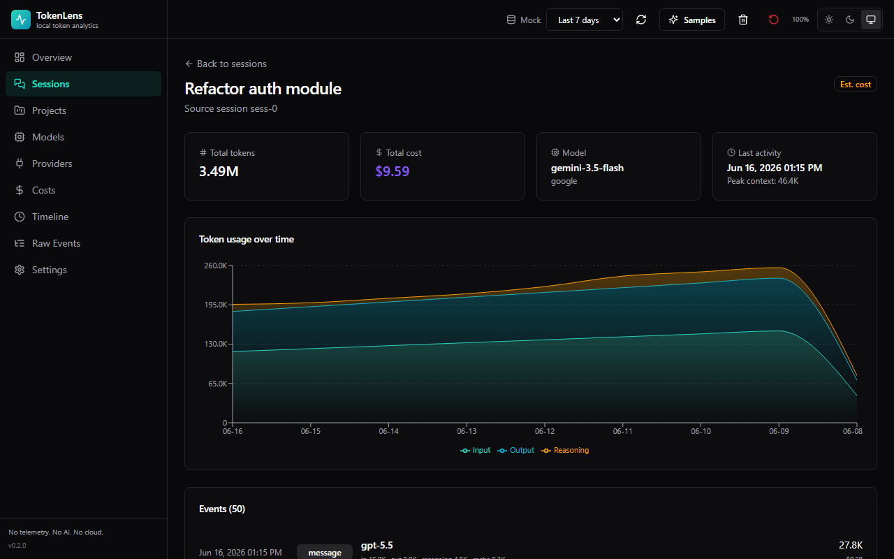
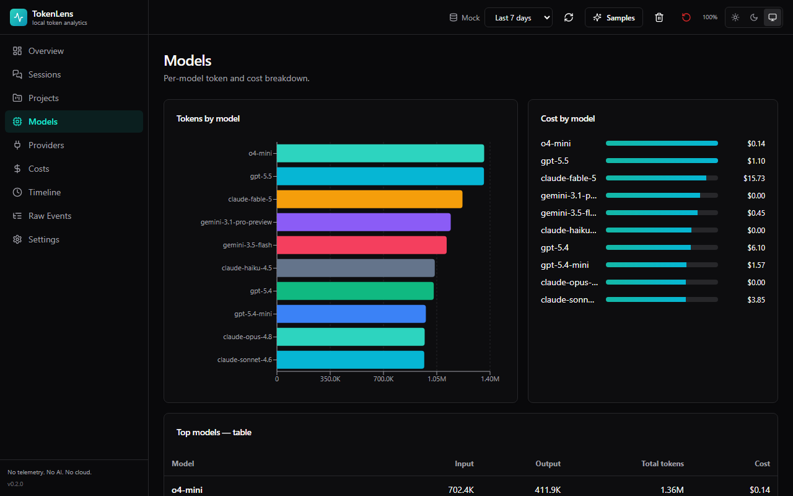
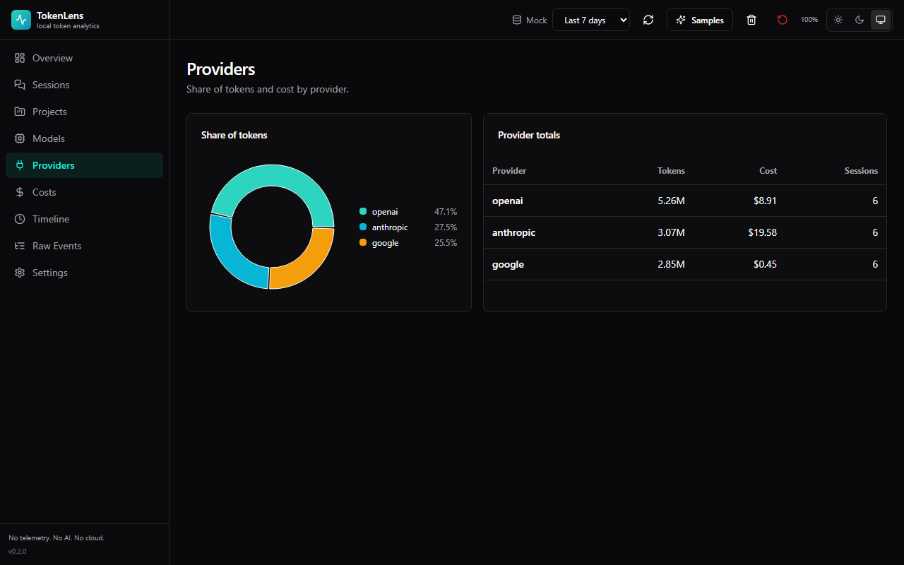
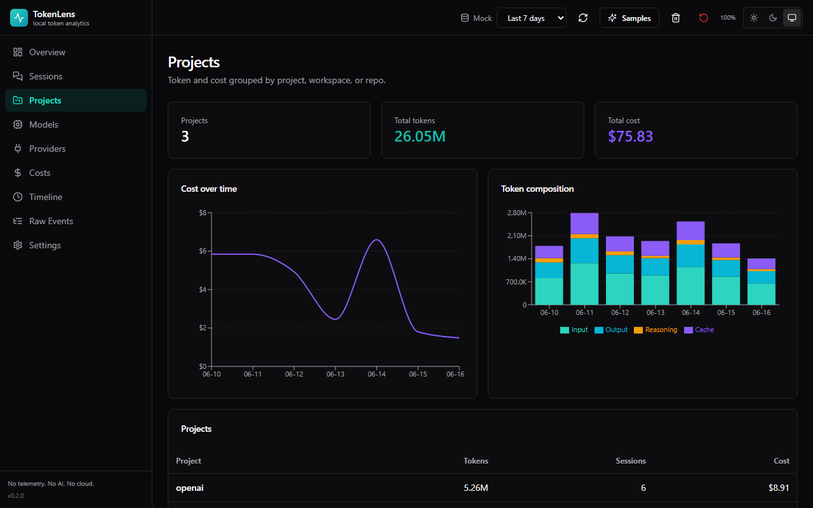
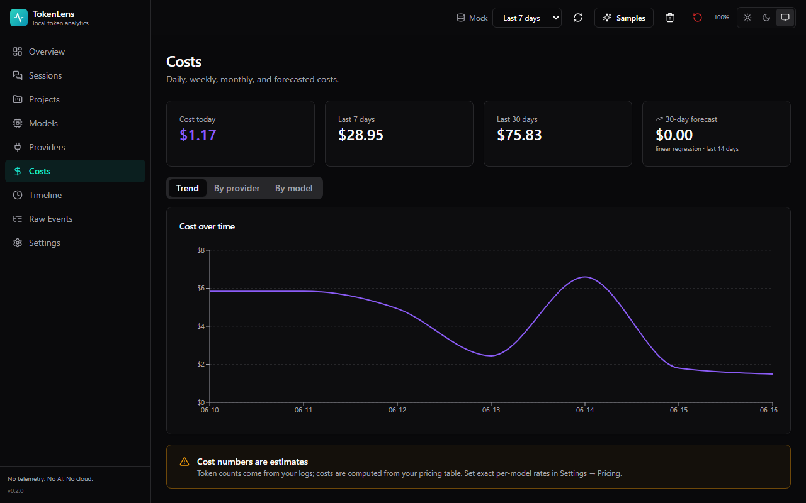
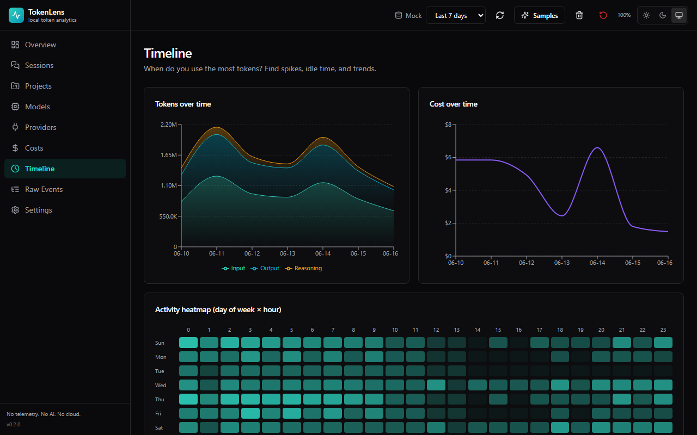
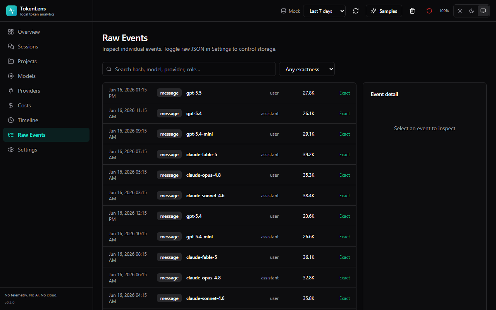
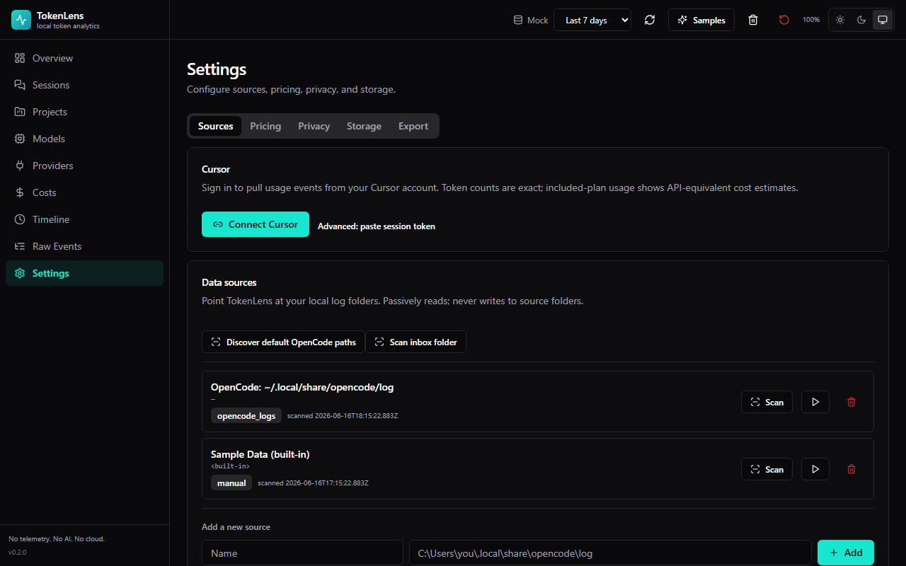

# TokenLens

> Local-first AI token and cost analytics. A Tauri v2 desktop app for understanding how many AI tokens you use, where they go, and what they cost. Runs entirely on your machine. **No cloud. No AI calls. No telemetry.**



## Features

- **Per-model, per-provider, per-project breakdowns** of tokens, cost, and cache savings
- **Sessions view** with per-message timeline, cumulative tokens, and peak context
- **Timeline heatmap** by day-of-week × hour
- **Cost engine** with editable per-model pricing (input, output, reasoning, cache read/write)
- **Exact vs. estimated** usage labels so totals never pretend to be more accurate than they are
- **Three collection modes**: passive log import, live folder watcher, or an optional OpenCode plugin
- **Privacy first**: no network calls, no full message storage by default, secret redaction, opt-in path anonymization
- **One-click reset** and configurable raw-JSON retention

## Screenshots

| | |
|---|---|
|  **Overview** |  **Sessions** |
|  **Session detail** |  **Models** |
|  **Providers** |  **Projects** |
|  **Costs** |  **Timeline** |
|  **Raw Events** |  **Settings** |

## Quick start

Requires Node 18+, Rust 1.77+, and the [Tauri v2 prerequisites](https://v2.tauri.app/start/prerequisites/) for your platform.

```bash
git clone https://github.com/Vortextbloons/TokenLens.git
cd TokenLens
npm install
npm run tauri:dev
```

That opens a desktop window. Click **Generate sample data** on the Overview page to explore the dashboard, or add a real source under **Settings → Sources**.

For a release build (`.msi` / `.dmg` / `.deb` / `.AppImage`):

```bash
npm run tauri:build
```

Output goes to `src-tauri/target/release/bundle/`.

## How it works

```
+-------------------+        +-----------------------+        +----------------------+
| Sources (logs,    |  --->  | Collectors +          |  --->  | SQLite (events,      |
| JSONL, plugin)    |        | Normalizer (Rust)     |        | sessions, pricing)   |
+-------------------+        +-----------------------+        +----------------------+
                                                                       |
                                                                       v
                                                                 +--------------+
                                                                 | Tauri UI     |
                                                                 | React + TS   |
                                                                 +--------------+
```

1. **Sources** — local log folders, a JSONL inbox, or the OpenCode plugin
2. **Collectors + Normalizer** — scans, watches, normalizes events, SHA-256 dedupes, persists
3. **SQLite** — events, sessions, projects, model pricing, daily aggregates, alerts (WAL mode)
4. **UI** — Recharts dashboards, filters, exports, settings

## Project layout

```
.
├─ src/                     React + TypeScript frontend
├─ src-tauri/               Rust backend (commands, db, ingest, collectors, pricing, redaction)
├─ collectors/              TS plugin shims
├─ pricing/                 Model pricing seed data (JSON)
├─ scripts/                 Dev utilities (screenshot capture, etc.)
├─ docs/                    Architecture, data model, privacy, design notes, screenshots
└─ README.md                This file
```

## Privacy

- **No network calls.** No telemetry. No cloud sync. No AI calls in the analytics path.
- **No full message storage** by default — only token counts, metadata, and event hashes.
- **Secret redaction** strips obvious API keys (OpenAI, Anthropic, Google, GitHub, AWS, JWT, private keys) before raw JSON is persisted.
- **Path anonymization** is opt-in under Settings.
- **Reset all data** is a one-click operation.
