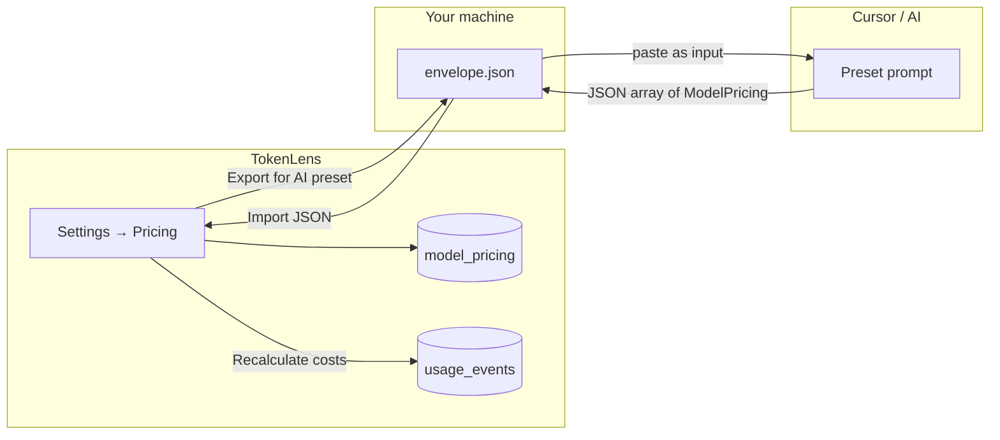

# AI Pricing Research Preset for TokenLens

A repeatable workflow for keeping TokenLens's `model_pricing` table current
without adding any network calls to the app itself. You run a small
preset-style prompt in Cursor (or any agent with web search), feed it the
list of models you actually use, and the AI returns a JSON file you paste
back into **Settings → Pricing → Import JSON**.

The app never phones home. The browser, the Tauri shell, and the SQLite
database all stay offline. Pricing data only enters TokenLens through the
explicit bulk-import path described here.

## What this solves

- `model_pricing` is the single source of truth for cost
  ([`src-tauri/src/pricing/mod.rs`](../src-tauri/src/pricing/mod.rs)). A
  missing `(provider, model)` row silently records `cost_usd = 0` for every
  matching event ([`compute_cost`](../src-tauri/src/pricing/mod.rs)).
- New models show up in your logs faster than `seed_defaults()` can keep
  up with. Re-seeding blindly is risky because it overwrites your manual
  edits.
- The Settings → Pricing UI only supports editing one row at a time. With
  dozens of missing models (gateway aliases, free tiers, new releases) the
  manual flow does not scale.

## The full loop



1. **Export** the model list (and current pricing) from TokenLens.
2. **Run** the AI preset with that envelope as the input.
3. **Validate** the AI's output (units, exact key matching, etc.).
4. **Import** the JSON back into TokenLens.
5. **Recalculate costs** to refresh every event's `cost_usd`.

---

## Step 1 — Export the model list

You have three ways to do this. Pick the one that matches your environment.

### A. From the UI (recommended)

Open **Settings → Pricing**. The new **Pricing research workflow** card has
three buttons:

- **Show missing pricing** — renders the live SQL from below, scoped to
  in-use models.
- **Export for AI preset** — opens a save dialog, writes
  `tokenlens-pricing-research.json`. The file contains:

  ```json
  {
    "generated_at": "2026-06-15T10:00:00Z",
    "instruction": "See docs/pricing-research-preset.md...",
    "already_priced": [ /* ModelPricing[] */ ],
    "missing": [ { "provider": "openai", "model": "gpt-5.4-mini", "events": 412, "total_tokens": 9_500_000, "current_cost_usd": 0 }, ... ]
  }
  ```

- **Import JSON** — opens the paste dialog used in step 4.

In dev/mock mode (no Tauri save dialog) the export goes to your clipboard
and the import dialog opens automatically.

### B. Manual SQL (one-off)

The same query the UI runs, against `<app local data>/TokenLens/tokenlens.sqlite`:

```sql
-- Models in use but missing pricing
SELECT DISTINCT
  e.provider,
  e.model,
  COUNT(*) AS events,
  SUM(e.total_tokens) AS tokens,
  SUM(e.cost_usd) AS current_cost_usd
FROM usage_events e
LEFT JOIN model_pricing p
  ON p.provider = e.provider AND p.model = e.model
WHERE e.ignored = 0
  AND e.provider IS NOT NULL
  AND e.model IS NOT NULL
  AND p.id IS NULL
GROUP BY e.provider, e.model
ORDER BY tokens DESC;
```

And the rows that already have pricing (so the AI does not duplicate work):

```sql
SELECT provider, model, input_price_per_million, output_price_per_million,
       reasoning_price_per_million, cache_read_price_per_million,
       cache_write_price_per_million, source, updated_at
FROM model_pricing
ORDER BY provider, model;
```

DB path: `%LOCALAPPDATA%\TokenLens\tokenlens.sqlite` on Windows,
`~/Library/Application Support/TokenLens/tokenlens.sqlite` on macOS,
`~/.local/share/TokenLens/tokenlens.sqlite` on Linux.

### C. Tauri command (programmatic)

```ts
import { exportPricing, listMissingPricing } from "@/lib/tauri";
const [priced, missing] = await Promise.all([exportPricing(), listMissingPricing()]);
```

Both commands are exposed in [`src/lib/tauri.ts`](../src/lib/tauri.ts) and
are part of the public surface in
[`src-tauri/src/commands/mod.rs`](../src-tauri/src/commands/mod.rs).

---

## Step 2 — The preset prompt

Paste this whole block into a new Cursor / agent chat, then attach (or
paste) the envelope JSON from step 1 as the input.

```text
You are updating TokenLens model pricing. TokenLens stores USD per 1 million
tokens for each (provider, model) pair in a SQLite table called model_pricing.
Cost formula:
  cost = (input * in_price + output * out_price + reasoning * r_price
        + cache_read * cr_price + cache_write * cw_price) / 1_000_000
If a row is missing, cost is recorded as $0.

INPUT: a JSON envelope produced by `export_for_ai` in the TokenLens UI.
  - "already_priced": the current model_pricing table
  - "missing": distinct (provider, model) pairs from usage_events that
    have no row in model_pricing, ordered by token volume desc

TASK: For each row in "missing", find the official pricing page for that
provider/model and extract input and output price per 1M tokens in USD.

RULES
  1. Prefer the provider's own public pricing page. Do not cite blogs,
     third-party aggregators, or marketing pages unless the provider has
     no public page. Examples:
       openai             -> https://openai.com/api/pricing
       anthropic          -> https://docs.anthropic.com/en/docs/about-claude/pricing
       google             -> https://ai.google.dev/gemini-api/docs/pricing
       opencode / opencode-go -> https://opencode.ai (Zen / model pricing)
       local, lmstudio    -> is_local: true, all rates = 0
  2. The provider string in your output MUST exactly match the provider
     string in the input envelope (case-sensitive). Same for model.
     If the model is served through a gateway, set provider to the gateway
     name from the envelope — never rename.
  3. Units are USD per 1 MILLION tokens. If the source quotes per 1K,
     multiply by 1000. If it quotes per token, multiply by 1_000_000.
  4. If pricing is split (prompt vs completion, input vs output, cached
     input, etc.), map the names carefully. Default reasoning/cache to 0
     unless the official page lists them separately.
  5. If the model is free, local, or behind a free tier flag in the
     provider's docs, set is_local: true and all rates to 0.
  6. If you cannot find authoritative pricing, omit that row from the
     output — DO NOT guess. The user will fill in unknowns manually.
  7. If a row is in "already_priced", do not include it in your output
     unless the existing rate is clearly wrong (and you have a better
     source). Skipping is the safe default.

OUTPUT: a JSON array. Each object MUST match this schema exactly:

  {
    "provider": "string, case-sensitive, must equal input.provider",
    "model": "string, case-sensitive, must equal input.model",
    "input_price_per_million": number,
    "output_price_per_million": number,
    "reasoning_price_per_million": number,
    "cache_read_price_per_million": number,
    "cache_write_price_per_million": number,
    "currency": "USD",
    "effective_date": "YYYY-MM-DD" | null,
    "is_local": boolean,
    "source": "ai-research:<url>" | "ai-research:unknown",
    "notes": "optional one-line citation"
  }

Output ONLY the JSON array. No prose, no markdown fences, no commentary.
The TokenLens importer parses the response with JSON.parse.
```

### Provider lookup hints

If the AI is unsure, these starting points work for the most common cases:

| Provider pattern | Start here |
| --- | --- |
| `openai` | https://openai.com/api/pricing |
| `openai-responses`, `openai-chat-completions` | Same as `openai` (API compat alias) |
| `anthropic` | https://docs.anthropic.com/en/docs/about-claude/pricing |
| `google` / `gemini` | https://ai.google.dev/gemini-api/docs/pricing |
| `mistral` | https://docs.mistral.ai/getting-started/models/ |
| `deepseek` | https://api-docs.deepseek.com/quick_start/pricing |
| `xai` / `grok` | https://docs.x.ai/docs/models |
| `cohere` | https://cohere.com/pricing |
| `opencode`, `opencode-go` | https://opencode.ai (gateway pricing) |
| `local`, `lmstudio` | `is_local: true`, all rates = 0 |

---

## Step 3 — Validate the AI output

Before pasting back, eyeball the JSON. Catching errors here is much
cheaper than chasing wrong totals on the Costs page.

- **Unit sanity.** Per-million values for frontier models land roughly in
  `0.05`–`75.00`. Reject anything that looks like per-token (e.g.
  `0.00025`) or per-1K-not-scaled (e.g. `0.00025` mislabeled). A useful
  mental check: gpt-4o-class output is around $10/1M, gemini-2.5-flash
  output is around $0.30/1M.
- **Exact key matching.** `provider` and `model` strings must equal
  exactly what `usage_events` contains — `compute_cost` is a strict
  lookup. Case matters. A model called `gpt-5.4-mini` in your events
  must come back as `gpt-5.4-mini` in the JSON, not `gpt-5-4-mini` or
  `gpt-5.4-mini-2025-08-01`.
- **Gateway vs vendor.** If your events store `provider = "opencode-go"`,
  the JSON must also say `provider = "opencode-go"`. The AI must not
  rewrite it to `anthropic` or `google` even if the underlying vendor is
  one of those. Set the `notes` field to flag the mapping.
- **One row per pair.** No duplicates inside the output array. If the AI
  repeated a row, delete the second copy.
- **No silent zeros.** Rows with `is_local: false` and zero rates for
  *both* input and output are almost always wrong — they will silently
  flatten the cost. Omit those rows and fill them in by hand.
- **Source URL.** Every row should have a `source` of
  `ai-research:<url>` so it is distinguishable from `seed` rows. This
  also makes the `pricing_history` audit log useful later.

---

## Step 4 — Import back into TokenLens

1. Open **Settings → Pricing**.
2. Click **Import JSON**. A paste dialog opens.
3. Paste the validated JSON array.
4. Click **Import**.

The dialog is a textarea — no file picker, no upload, no network. After
parsing you'll see a toast like:

> Pricing imported — received 7 · inserted 6 · updated 1 · skipped 0

Empty / blank rows are skipped automatically. The import goes through
`pricing::upsert` for each row, so:

- A row that exists already is **updated** and an entry is appended to
  `pricing_history`.
- A row that does not exist is **inserted**.
- The in-memory pricing cache is refreshed as part of the import, so
  Costs / Overview will see the new rates the next time they query.

You will be asked whether to **Recalculate costs now**. Click Yes
(equivalent to clicking the Refresh icon in the topbar). That walks
`usage_events` and recomputes `cost_usd` for every row using the
updated table.

If you skipped the prompt, you can trigger a recalc any time from the
topbar Refresh icon.

---

## Step 5 — Verify

Open the **Costs** page and confirm:

- **Cost today / Last 7 days / Last 30 days** numbers moved from
  whatever they were before the import (probably understated).
- The **By model** breakdown now lists the models you just priced, with
  non-zero USD totals.
- The **By provider** breakdown shows the new spend in the right
  provider bucket.

Then open **Overview** and confirm the same numbers there. If a model
still shows $0 after recalc:

1. Open the raw model row in Settings → Pricing — verify `is_local` is
   false and the rates are non-zero.
2. Check the provider/model strings match the values in
   `usage_events.provider` / `usage_events.model` exactly. A stray
   dash vs underscore is the usual culprit.

---

## Refresh cadence

Re-run the preset when:

- The **Show missing pricing** list grows.
- A provider changes rates (check `effective_date`).
- A new OpenCode / OpenAI / Anthropic model release hits your logs.

A monthly cadence is fine for most users. Power users with rotating
gateway model aliases may want to run it weekly.

---

## What we are NOT doing (by design)

- **No automatic network calls in TokenLens.** The privacy guarantee in
  [`docs/privacy.md`](privacy.md) holds: the app cannot reach the
  network. Pricing data enters only through the explicit bulk-import
  command.
- **No replacing `seed_defaults()` blindly.** Seeded rows use
  `source = "seed"`; research rows use `source = "ai-research:<url>"`.
  The two are distinguishable in `pricing_history` and in the UI.
- **No guessing for unknown models.** Omit them from the output; the
  user fills in unknowns manually. This is the only way to keep the
  cost numbers honest.

---

## Architecture reference

- **Rust commands** in
  [`src-tauri/src/commands/mod.rs`](../src-tauri/src/commands/mod.rs):
  - `import_pricing_json(rows: Vec<ModelPricing>)` —
    `pricing::bulk_upsert` for idempotent upserts with history
    ([`src-tauri/src/pricing/mod.rs`](../src-tauri/src/pricing/mod.rs)).
  - `export_pricing()` — returns the current `model_pricing` table.
  - `list_missing_pricing()` — returns in-use models with no row,
    ordered by token volume desc.
- **Frontend wiring** in
  [`src/lib/tauri.ts`](../src/lib/tauri.ts) and the **Pricing** tab of
  [`src/pages/Settings.tsx`](../src/pages/Settings.tsx).
- **Mock backend** in
  [`src/lib/mock.ts`](../src/lib/mock.ts) supports the same three
  commands so you can iterate on the UI in plain `vite dev` without
  Tauri.
- **Schema** in
  [`src-tauri/migrations/001_init.sql`](../src-tauri/migrations/001_init.sql).
  No migration is needed for the research workflow — it reuses the
  existing `model_pricing` and `pricing_history` tables.

---

## Success criteria

- Every high-volume `(provider, model)` from your export has
  `input_price_per_million` and `output_price_per_million` set.
- Costs / Overview show non-zero USD for previously $0 models after
  **Recalculate costs**.
- Each row has a traceable `source` URL for audit
  (`ai-research:https://...`).
- `pricing_history` has a snapshot of the previous values for any row
  the import updated, so you can roll back.
